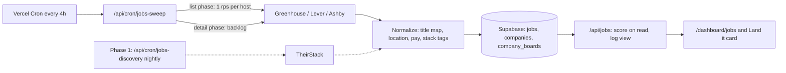

# RFC: Job listings in Land it

**Author:** Jordan Lamoreaux
**Date:** 2026-09-24
**Status:** Draft (rev. 3)
**Project:** CareerOtter (apptrack.ing)

> **Revision history**
>
> **Rev. 2** retargeted rev. 1 to the real stack (Vercel Cron and Supabase, not Cloudflare) and to
> production data. The main changes:
>
> - Phase 0 became a shared pool of public ATS boards, because a feed built from each user's own
>   tracker covers only 19 of 52 users.
> - TheirStack became a gated Phase 1.
> - Measurement moved to a randomized holdout.
>
> **Rev. 3** applies review feedback:
>
> - **Phase 1 gate.** Now based on engagement split by feed depth. It was circular.
> - **Taxonomy.** Sized from data: `operations` and `analyst` added, keyword matching for the long
>   tail, and a separate management track so director roles no longer leak into IC feeds.
> - **Measurement.** Views counted server-side. Holdout limited to new signups, analyzed by assigned
>   arm. A ship rule written down in advance replaces an undetectable "+10 points" target.
> - **Sweep.** Split into list and detail phases. First-sweep backfills flagged.
> - **Schema.** No cascading deletes. Boards split from companies so a company can change ATS.
>   Domain fill-in before Phase 1.
> - **Reports.** "Not this company" and dead-link reports follow one rule.
> - **Add to tracker.** Never invents a `date_applied`.
> - **Resolver.** Embed fetches are SSRF-guarded, the async mechanism is named, and existing rows
>   get a backfill.
> - **Pay and location.** OTE-only pay counts as no posted base. Location uses structured ATS fields
>   first.
> - **Title-map gate.** Uses a stratified sample.
> - **Open questions.** Setup placement, holdout scope, seed ownership, and Workday are decided.

-----

## 0. Ground truth

### Stack

| Concern | Technology | Key locations |
| --- | --- | --- |
| Framework / hosting | Next.js 15.2 App Router on Vercel (Pro: sub-daily crons already run) | `app/`, `vercel.json` |
| Database | Supabase Postgres | `lib/supabase/*`, `schemas/` |
| Scheduled jobs | Vercel Cron → `app/api/cron/**`, guarded by `verifyCronAuth`, `maxDuration = 300` | `app/api/cron/careerotter-stock-prices/route.ts` is the closest template |
| Post-response work | `after()` from `next/server` (stable in 15.1+) | New |
| Cache | Upstash Redis | `lib/redis/client.ts` |
| Flags / analytics | PostHog | `lib/hooks/use-feature-flag.ts`, `lib/analytics/posthog.ts`, `lib/analytics/posthog-server.ts` |
| Role / level taxonomy | `COMP_ROLE_FAMILIES`, `COMP_LEVELS` | `lib/careerotter/market-data.ts` |
| Comp | `comp_entries` (`effective_date`, `base`, `currency`), service-role only | `schemas/migrations/033_careerotter_comp.sql` |
| Career profile | `career_profiles` (`role`, `level`, `mode`) | `schemas/migrations/032_careerotter_evidence.sql` |
| Application statuses | Fixed by a CHECK constraint: Applied, Interview Scheduled, Interviewed, Offer, Hired, Rejected. `date_applied` is `not null` | `schemas/applications.sql` |
| Plan limits | Tracking is unlimited on every tier (`FREE_MAX_APPLICATIONS: -1`) | `lib/constants/plans.ts` |

### Users and tracker data (production, 2026-09-24, aggregate queries only)

| Measure | Value |
| --- | --- |
| Profiles | 235 (20 signups in the last 30 days) |
| Users who have ever tracked an application | 52 |
| Users who added an application in the last 14 / 30 days | 8 / 12 |
| Applications / with a `role_link` / distinct companies | 261 / 240 / 220 |
| Users who have logged comp | 2 |
| `career_profiles` rows | 1 |

**Link mix.** Of 261 applications: 74 (28%) link directly to a Greenhouse, Lever, or Ashby board.
20 (8%) are Greenhouse embeds on a company careers page (`gh_jid=`), 20 (8%) are Workday, and 16
(6%) are LinkedIn.

**Slug guessing.** For the 152 companies without a direct link, probing the three board APIs with
the normalized company name found a live board for 45. A hand check flags about five of those as
wrong or ambiguous (for example "Stealth Startup" and "LinkedIn").

**Coverage from a user's own tracker.** Direct links plus guesses cover 124 of 261 applications
(48%), but only **19 of 52 users (37%)**, and **4 of the 12 users active in the last 30 days**.
Applications are concentrated in a few heavy users. **A feed built only from each user's own
tracked companies can't carry activation.**

**Role mix.** Each user is assigned the most common family among their tracked titles, using a
regex classifier:

| Family | Users | Users who tracked a management title |
| --- | --- | --- |
| `software_engineer` | 15 | 2 |
| `operations` (ops, coordinator, program/project, admin, assistant) | 9 | 0 |
| `customer_success` (support, success, CSM, client, implementation, onboarding) | 7 | 2 |
| `analyst` (business, strategy, consultant, research) | 4 | 0 |
| `product_manager` | 1 | 0 |
| `data` | 1 | 0 |
| `design` | 0 | 0 |
| Long tail (barista, marketer, account executive, test entries) | 15 | 0 |

No cluster in the long tail is big enough to justify a family.

**ATS fields (spot probes of live APIs).**

| Board | Open roles | Structured pay | Posting date | Location fields |
| --- | --- | --- | --- | --- |
| Ashby (Ramp) | 155 | 148 via `compensationTiers` | `publishedAt` | `address.postalAddress`, `isRemote`, `workplaceType`, `secondaryLocations` |
| Lever (Zoox) | 236 | 222 via `salaryRange` | `createdAt` | `country`, `workplaceType`, `categories.allLocations` |
| Lever (Palantir) | 318 | 0 | `createdAt` | same |
| Greenhouse (Stripe) | 692 | 0. `pay_input_ranges` present but empty, so pay has to be parsed from `content` | `first_published` on all 692 | `location.name` (free text), plus `company_name` on each job |

Every source carries a real posting date, and every feed needs filtering from day one (Stripe
alone has 692 roles).

-----

## 1. Summary

Add a Jobs feed to Land it that shows open US and US-remote roles matched to the user's role
family, level, and location, ranked by fit. When both sides are known, roles whose posted base pay
starts above the user's current base sort first.

Phase 0 costs $0. Vercel crons sweep the public Greenhouse, Lever, and Ashby board APIs for a
shared pool of companies: every company any user tracks, plus a curated seed list, about 300 in
total. Listings land in Postgres, and each user's feed is computed on read. Users never cause an
outbound call.

Phase 1 adds TheirStack ($49/month for 1,500 records) only when the data shows the pool, not the
feed design, is what's failing: users with deep, relevant feeds engage at target while users with
thin feeds don't (section 8).

## 2. Motivation and goals

Activation is the binding constraint: users drop off after day one or two. A feed of fresh, matched
roles gives a reason to return on day three that doesn't depend on the user's own activity.

The brand guide commits to: "24 roles match your level and stack. Six pay above your current band.
Sorted by that." This RFC makes that line true where it can be, and honest elsewhere.

**Goals**

1. A new user who confirms role family, level, and location sees a matched feed that same day,
   regardless of how many applications they have tracked.
2. After a user applies through a listing, logging it in the tracker takes one tap and uses the
   date they confirm. The feed never writes an application the user hasn't confirmed.
3. When both the listing's posted base pay and the user's comp are known, roles whose base pay
   minimum is strictly above the user's current base sort first.
4. Phase 0 runs at $0 beyond existing Vercel and Supabase plans. Phase 1 stays within $49/month
   until the upgrade rule in section 8 fires.
5. A listing that disappears from its ATS board is hidden within 24 hours. A listing that can't be
   re-verified is hidden within 72 hours (ATS) or 30 days (TheirStack).

**Non-goals for v1**

- Applying inside CareerOtter. We link out.
- Scraping LinkedIn, Indeed, or Glassdoor, directly or by displaying vendor records that point to
  them.
- Coverage outside the US and US-remote.
- **Workday**, in v1 and v1.1. Its only JSON endpoints are undocumented, so using them is scraping
  under another name. Its employers also skew enterprise, away from our user mix.
- Job alert emails and push notifications (Phase 2).
- Employer-side posting or any recruiter product.

## 3. Data sources

| Source | What it gives us | Cost | Constraint | Role |
| --- | --- | --- | --- | --- |
| Greenhouse Job Board API | Open roles with `first_published`, `company_name`, and `content` HTML on the detail call | Free, no key | Needs the board token. Structured pay usually empty | Phase 0 pool |
| Lever Postings API | Open roles with descriptions, `salaryRange`, `salaryDescription`, `country`, `workplaceType` | Free, no key | Pay coverage varies by employer | Phase 0 pool |
| Ashby Posting API | Open roles with `compensationTiers` (`includeCompensation=true`), structured address, `isRemote` | Free, no key | Needs the slug | Phase 0 pool |
| [TheirStack](https://theirstack.com/en/pricing) | Deduplicated postings with normalized salary, seniority, location, and technology | $49/month for 1,500 API credits. 1 credit per job returned, including repeats. Credits roll over 12 months | Indexes job boards including LinkedIn, so filter to employer URLs at query time | Phase 1, gated |
| Adzuna | Search and salary histograms | Free tier | Logo on every listing; licence limits | Fallback only |
| JSearch (OpenWeb Ninja) | Google for Jobs results | Free tier | Resells scraped results | Rejected |
| Indeed, LinkedIn | n/a | n/a | Deprecated / partner-only | Unavailable |

## 4. The board pool

### 4.1 What is in it

`companies` holds employer identity. `company_boards` holds the ATS boards we sweep (6.1). A board
enters the pool one of four ways, recorded in `slug_source`:

| `slug_source` | How | Phase 0 volume |
| --- | --- | --- |
| `link` | Parsed from `role_link`: `boards.greenhouse.io/{slug}`, `job-boards.greenhouse.io/{slug}`, `jobs.lever.co/{slug}`, `jobs.ashbyhq.com/{slug}` | ~67 boards |
| `embed` | The `role_link` carries `gh_jid=`. Fetch the careers page once, under the SSRF guard (4.4), and read the `for=` token from the Greenhouse embed script | Up to 20 applications |
| `guess` | Normalized company name probed against all three APIs, then verified (4.2) | ~40 boards |
| `seed` | Hand-curated US employers on the three ATSs | ~190 boards, for **~300 in the pool in total** |

The pool is global. A board being in it reveals nothing about which user tracks it.

**When resolution runs.**

- **New and edited applications.** The API routes that create or edit an application schedule
  resolution with `after()` from `next/server`. It runs after the response is sent, so it never
  adds latency. It sets `applications.company_id` on success.
- **Nightly retry.** A retry step in the sweep cron picks up rows where `company_id is null` and
  the last resolution attempt is more than 7 days old.
- **One-time backfill.** Before Phase 0a exit, a cron-guarded route
  (`/api/cron/jobs-backfill-company-ids`, run manually, then removed) resolves the existing 261
  applications in batches.

### 4.2 Verifying guessed slugs

A guessed slug is accepted only when one of these holds:

- **Greenhouse:** the jobs' `company_name` (or `GET /v1/boards/{token}` → `name`) normalizes to the
  same string as the tracked company name.
- **Lever / Ashby:** the company name appears in at least half of the returned postings'
  descriptions.

A deny-list rejects generic names ("stealth", "confidential", "startup", "stealth startup").

### 4.3 Seed list

- **Where it lives.** `lib/jobs/seed-boards.ts` holds `{ ats_type, ats_slug, name, domain }`,
  loaded by an idempotent upsert.
- **What it starts from.** The ~110 boards the tracker already resolves.
- **What to add.** About 190 employers by hand, weighted to the families in section 0:
  - operations- and support-heavy employers (B2B SaaS, fintech, health tech, marketplaces);
  - analyst-heavy employers (consulting-adjacent SaaS, fintech).
- **Owner.** Jordan. Review monthly, driven by the disabled-board count and feed depth by family
  (section 10).
- **Domain required.** Every seed entry must carry `domain`.

### 4.4 Fetching user-supplied URLs

Embed resolution is the only place we fetch a URL a user typed. `lib/jobs/safe-fetch.ts`:

- `https:` only. No credentials in the URL. Default port only.
- Resolve DNS and reject loopback, private (RFC 1918), link-local (169.254/16, including cloud
  metadata), CGNAT (100.64/10), unique-local IPv6, and IPv4-mapped IPv6 forms of those.
- Follow at most 3 redirects manually and re-run every check on each hop.
- Pin the connection to the vetted IP, so a DNS rebind between check and connect can't redirect
  it.
- 5-second total timeout. Stop reading at 1 MB. Accept `text/html` only. No cookies.
- Never follow a URL taken from the fetched page itself. Only the extracted `for=` token is used,
  and it is validated against `^[a-z0-9_-]{1,100}$` before any Greenhouse call.

## 5. Architecture



### 5.1 Sweep cron

`/api/cron/jobs-sweep` runs on `30 */4 * * *` with `maxDuration = 300`. Three hosts run in
parallel, and a shared token bucket holds each host to one request per second across both phases.

**List phase (first ~150 seconds).**

- Picks boards with `status = 'active'` and `last_swept_at` older than 20 hours, oldest first.
- One list request per board:
  - Upsert job rows (source id, title, location fields, posting date, apply URL). Lever and Ashby
    rows are complete at this point, because their lists include descriptions and pay.
  - Set `closed_at` on jobs absent from the list.
  - Set `last_swept_at`.
- **A board is fully swept for closure and freshness purposes after one request, however large
  it is.**
- **Capacity:** about 150 boards per host per run (list requests only), six runs a day.

**Detail phase (remaining time, stops at ~270 seconds).**

- Only Greenhouse needs this, because the list has no `content`.
- New or changed Greenhouse jobs that pass the cheap pre-filter (US or bare-remote location, and a
  mapped family or a long-tail keyword hit) get `detail_status = 'pending'`. The rest get
  `'skipped'`.
- Each run drains the pending backlog in `first_published desc` order, so current roles fill in
  first.
- At about 120 detail calls per run and six runs a day, a large new board drains in one to two
  days.
- **Pending jobs are shown meanwhile.** They carry title, location, and date, so they can be
  matched. They get no pay label, and the stack term is dropped for them (section 7).

**First sweep.**

- Jobs inserted during a board's first successful sweep get `backfilled = true`.
- Freshness uses the source posting date (`first_published`, `createdAt`, `publishedAt`), which
  all three sources provide.
- If a date is ever missing, a backfilled job gets `fresh = 0` rather than falling back to
  `first_seen_at`.
- The Phase 2 digest's "new roles" means `backfilled = false and posted_at > last digest`, so
  adding a company never floods it.

**Errors and etiquette.**

- A 404 or 403 on a board sets its status to `disabled` for review. It is not retried nightly.
- `User-Agent: CareerOtter jobs sweep (contact: <support address>)`.
- The cron follows the stock-price cron's shape: `verifyCronAuth`, `createAdminClient`,
  `loggerService`, and a `MAX_BOARDS` backstop.

### 5.2 Normalizer

`lib/jobs/normalize.ts` is shared by all sources.

- **Title map** (`lib/jobs/title-map.ts`): maps a title to a family and a level (6.2). Unmapped
  values stay `null`.
- **Location.** Structured fields first, text parsing second:
  - Ashby: `address.postalAddress.addressCountry`, `isRemote`, `secondaryLocations`.
  - Lever: `country`, `workplaceType`, `categories.allLocations`.
  - Greenhouse: `location.name` only, so parse it.
- **Multi-location strings** are split on `;`, `|`, ` or `, ` / `, and newlines. A job is US when
  any location is.
- **A bare "Remote"** with no country is stored as `remote_type = 'remote'`,
  `location_confidence = 'inferred'`. It is treated as US-remote when both hold:
  - the board has at least one US-located posting;
  - the description names no non-US restriction ("EMEA", "Europe", "UK", "Canada", "LATAM",
    "APAC", "India", or a non-US country list).

  Otherwise it is dropped.
- **Pay:** see 6.3.
- **Stack tags:** dictionary match against about 150 terms (`lib/jobs/stack-tags.ts`).
  `stack_extracted = false` when there was no description to read, which is different from "read,
  found nothing".

### 5.3 Feed API

`GET /api/jobs`:

1. Loads prefs, tracked applications (with status and `company_id`), the user's hidden jobs, and
   the latest comp row.
2. Selects open US jobs through the `(role_family, level)` index.
3. Scores them in TypeScript and returns the top 50.
4. **Inserts one `job_feed_views` row** (user, arm, match count, useful-match count). That table
   is the server-side denominator for every per-view metric.

There is no cache in v1. If p95 goes over 300 ms, add a 12-hour Upstash entry per user,
invalidated on prefs, comp, or tracker changes. The view row is written on every request either
way.

### 5.4 UI

- **Where.** `app/(app)/dashboard/jobs` is the page. The count card goes in the Land it tools
  section of `app/(app)/dashboard/applications/page.tsx`.
- **Job setup** is rendered **inline on that card** the first time a user without prefs sees it,
  prefilled (6.4), so confirming is one tap. It is not an onboarding step: `career_profiles` has
  one row, which suggests users skip optional setup.
- **Listing actions:**
  - **Save:** a Jobs-only list.
  - **Apply:** links out and records `apply_clicked`.
  - **I applied:** creates the application (section 7, "Logging an application").
  - **Dismiss.**
  - An overflow menu with **Report dead link** and **Not this company**.
- Client components call `/api/jobs*` routes only (CLAUDE.md rule 4).

## 6. Data model, taxonomy, and pay

### 6.1 Migration `044_job_listings.sql`

- **RLS.** Every table has RLS enabled with no policies, the same as `comp_entries`.
- **No hard deletes.** Nothing in this schema is hard-deleted in normal operation. Boards and jobs
  retire through status columns, and foreign keys are `restrict` so an accidental delete fails
  loudly instead of erasing users' saves and the metrics derived from them.
- **Account deletion** still cascades from `profiles`.

```sql
create table public.companies (
  id uuid primary key default gen_random_uuid (),
  name text not null,
  normalized_name text not null,
  domain text,                               -- required before a company is used in Phase 1 exclusions
  created_at timestamptz not null default now()
);
create unique index companies_domain_key on public.companies (domain) where domain is not null;

-- One company can have several boards over time (e.g. Lever retired, Ashby active).
create table public.company_boards (
  id uuid primary key default gen_random_uuid (),
  company_id uuid not null references public.companies (id) on delete restrict,
  ats_type text not null check (ats_type in ('greenhouse', 'lever', 'ashby')),
  ats_slug text not null,
  slug_source text not null check (slug_source in ('link', 'embed', 'guess', 'seed', 'theirstack')),
  status text not null default 'active'
    check (status in ('active', 'disabled', 'disputed', 'retired')),
  first_swept_at timestamptz,
  last_swept_at timestamptz,
  created_at timestamptz not null default now(),
  unique (ats_type, ats_slug)
);

alter table public.applications
  add column company_id uuid references public.companies (id) on delete set null,
  add column company_resolved_at timestamptz;

create table public.jobs (
  id uuid primary key default gen_random_uuid (),
  source text not null check (source in ('greenhouse', 'lever', 'ashby', 'theirstack')),
  source_job_id text not null,
  company_id uuid references public.companies (id) on delete restrict,
  board_id uuid references public.company_boards (id) on delete restrict,
  title text not null,
  role_family text,                          -- null = unmapped
  level text,                                -- null = unknown
  city text, region text, country text not null default 'US',
  remote_type text check (remote_type in ('onsite', 'hybrid', 'remote')),
  location_confidence text not null check (location_confidence in ('structured', 'parsed', 'inferred')),
  pay_min_usd integer, pay_max_usd integer,
  pay_basis text not null default 'none' check (pay_basis in ('structured', 'parsed', 'none')),
  pay_tiers jsonb,
  stack_tags text[] not null default '{}',
  stack_extracted boolean not null default false,
  detail_status text not null default 'done' check (detail_status in ('pending', 'done', 'skipped')),
  backfilled boolean not null default false,
  apply_url text not null,
  posted_at timestamptz,
  first_seen_at timestamptz not null default now(),
  last_seen_at timestamptz not null default now(),
  closed_at timestamptz,
  hidden_reason text check (hidden_reason in ('dead_link', 'wrong_company')),
  raw jsonb,                                 -- dropped for rows closed > 90 days
  unique (source, source_job_id)
);
create index jobs_open_family_level_idx on public.jobs (role_family, level)
  where closed_at is null and hidden_reason is null;
create index jobs_open_board_idx on public.jobs (board_id) where closed_at is null;
create index jobs_detail_backlog_idx on public.jobs (posted_at desc) where detail_status = 'pending';

create table public.user_job_prefs (
  user_id uuid primary key references public.profiles (id) on delete cascade,
  role_family text not null,                 -- includes 'other'
  level text,
  include_management boolean not null default false,
  title_keywords text[] not null default '{}',  -- used when role_family = 'other'
  locations text[] not null default '{}',
  remote_ok boolean not null default true,
  stack_tags text[] not null default '{}',
  updated_at timestamptz not null default now()
);

create table public.user_job_actions (
  user_id uuid not null references public.profiles (id) on delete cascade,
  job_id uuid not null references public.jobs (id) on delete restrict,
  action text not null check (action in
    ('saved', 'dismissed', 'apply_clicked', 'applied', 'reported_dead', 'not_this_company')),
  created_at timestamptz not null default now(),
  primary key (user_id, job_id, action)
);

create table public.job_feed_views (
  id bigint generated always as identity primary key,
  user_id uuid not null references public.profiles (id) on delete cascade,
  arm text,                                  -- null for users outside the experiment
  match_count integer not null,
  useful_match_count integer not null,
  created_at timestamptz not null default now()
);
create index job_feed_views_user_time_idx on public.job_feed_views (user_id, created_at);

create table public.experiment_assignments (
  user_id uuid not null references public.profiles (id) on delete cascade,
  experiment text not null,
  arm text not null,
  assigned_at timestamptz not null default now(),
  primary key (user_id, experiment)
);
```

### 6.2 Taxonomy

The taxonomy lives in `lib/constants/job-taxonomy.ts`. `lib/careerotter/market-data.ts` imports
the four families it has ranges for.

**Families**

- `software_engineer`, `product_manager`, `data`, `design`.
- `customer_success`: support, success, CSM, client, implementation, onboarding.
- `operations`: operations, coordinator, program and project management, administrator, assistant.
- `analyst`: business, financial, strategy, and research analyst, and consultant. A data analyst
  maps to `data`.
- `other`: matched on title keywords, not family (section 7).

**Levels: two tracks**

| Track | Levels | Title signals |
| --- | --- | --- |
| Individual contributor | `junior` | intern, entry, associate, I, coordinator (non-lead) |
| | `mid` | II, unmarked |
| | `senior` | Sr, senior, III, "tech lead" or "lead engineer" in engineering families |
| | `staff` | staff, principal, distinguished |
| Management | `manager` | manager (except product, account, program, and project manager, which are IC titles), supervisor, "team lead" or "lead" in non-engineering families |
| | `director` | director, head of, VP, vice president, chief |

**Level rules**

- **The window.** ±1 step within the same track. A user never sees the other track unless
  `include_management` is on (for IC users) or they chose a management level.
- **Management-first check.** Management keywords are checked first, so "Director, Customer
  Success" maps to `customer_success` / `director` and never reaches a junior specialist's feed
  through a null level.
- **Null level** means no signal. It passes the window at a reduced score (section 7).
  Management titles can no longer be null.

**Title-map accuracy gate (Phase 0a exit).**

- Hand-label a **stratified** sample from the swept pool: at least 40 titles per family,
  oversampled to 60 for `software_engineer`, `operations`, and `customer_success` (the largest user
  groups), and at least 40 management titles across families.
- Require 90% family accuracy per family, not pooled, and 85% level accuracy. On management
  titles, require 95% track accuracy, because a track error is the visible failure.

### 6.3 Pay

| Source | Extraction | `pay_basis` |
| --- | --- | --- |
| Ashby | `compensationTiers[].components` with `compensationType = 'Salary'` only (commission and bonus components are ignored) | `structured` |
| Lever | `salaryRange`, unless `salaryDescription` trips the OTE check below | `structured` |
| Greenhouse | `pay_input_ranges` when non-empty; otherwise parse `content` for US ranges | `structured` or `parsed` |
| TheirStack | Annual USD min/max (verify field names) | `structured` |

Rules:

- Only annual USD **base** ranges count. Hourly, equity-only, and unparseable text become `none`.
- **OTE check.** If the text within 200 characters of a range mentions "OTE", "on-target",
  "on target earnings", "commission", "variable", or "incentive", treat it as **no posted base**
  (`none`).
  - It applies to parsed ranges and to Lever's `salaryDescription`.
  - It matters most for `customer_success` and sales-adjacent roles, where an OTE-only range would
    otherwise inflate "above your band".
- A parsed range is accepted only when `20,000 ≤ min ≤ max ≤ 2,000,000`.
- Never store an estimate.
- **Geo tiers** go into `pay_tiers`. The band check uses the tier matching the user's location, or
  the **lowest** minimum across tiers when none maps.
- **Phase 0a spot check:** 50 parsed ranges, including at least 15 from `customer_success`
  postings.

### 6.4 Prefs

The inline setup has three fields: family, level, and location/remote.

- **Management toggle.** "Include management roles" appears for IC levels in families where
  management titles exist.
- **Stack tags** appear only for engineering and data families.
- **Long-tail users.** `other` users see their title keywords as editable chips, extracted from
  their tracked roles after removing stopwords and level words.

Prefill order:

1. `career_profiles.role` / `level`.
2. The title map over the last ten `applications.role` values (majority vote, with keywords
   collected for `other`).
3. Blank.

Roast uploads are never used.

## 7. Matching and ranking

**Hard filters.** A job appears only when all of these hold:

- It is open, not `hidden_reason`-flagged, and US.
- **Family:** its family equals the user's. For `other` users: its title shares at least one of the
  user's `title_keywords`, and its family is `null` or `other`.
- **Level:** within the level window (6.2).
- **Location:** matches one of `locations`, or it is remote and `remote_ok` is set.
- **Not hidden by the user:** the user hasn't dismissed it or reported it (dead link or not this
  company).
- **Not already tracked:** it isn't in the user's tracker (by `apply_url`, or by `company_id` +
  normalized title).

**Score.** Weighted sum. Any term that doesn't apply is dropped and the rest renormalized.

```
S = (0.35·stack + 0.35·title + 0.25·level + 0.20·tracked + 0.20·fresh) / (sum of weights for terms that apply)
```

- **stack:** Jaccard overlap of tags. **Dropped** when the user has no tags **or** the job has
  `stack_extracted = false`. A failed extraction is not penalized. A read description with zero
  matching tags scores 0.
- **title:** `other` users only. The IDF-weighted share of the user's keywords present in the title.
- **level:** 1 for exact, 0.5 for one step off, 0.25 for null.
- **tracked:** 1 when `company_id` matches one of the user's non-`Rejected` applications, 0.5 when
  every match is `Rejected`.
- **fresh:** linear from 1 at `posted_at` to 0 at 30 days. 0 for a backfilled job with no source
  date.

Tune the weights against the logged-application rate once there are 200 or more feed views.

**Useful matches.** A match is "useful" unless the user has dismissed at least half of what they
were shown in that family in the last 14 days. That feeds the `useful_match_count` column and
feed depth (section 10). A feed can show 10 matches and still be wrong, and dismissals are how we
see it.

**Above your band.** Current base is the latest `comp_entries` row by `effective_date`, USD only in
v1. A job qualifies when `pay_basis <> 'none'` and its location-appropriate minimum is **strictly
greater** than the base. Above-band jobs sort first, then by score. The band line appears only
when 3 or more roles qualify.

| State | Header copy |
| --- | --- |
| Comp logged, some roles above band | 24 roles match your level and stack. 6 pay above your current band. Sorted by that. |
| Comp logged, none above band | 24 roles match. None post pay above your current base. That's useful to know before your review. |
| No comp logged (the default today) | 24 roles match your level and stack. Log your current pay in Comp and we'll sort by which ones pay more. |
| No stack tags | Same copy with "your role and level" in place of "your level and stack". |
| Zero matches | Nothing matches today. Widen location or level in your job settings. |

**Logging an application.**

- The feed never writes an application with an invented `date_applied`.
- **I applied** creates an `applications` row with status `Applied` and `date_applied` defaulting
  to today, editable before confirming. It also sets `role_link = apply_url` and `company_id`, and
  records the `applied` action.
- After an `apply_clicked`, the next feed load shows a one-line prompt: "Did you apply to {role}
  at {company}?" It offers **Yes** (same as I applied) or **Not yet**.
- **Saving an interesting role doesn't touch `applications`.** Saves stay in the Jobs list.
- **Rejected alternative:** a new `Saved` application status with a nullable `date_applied`. It
  would change the status CHECK constraint, the status constants, the Sankey, and every analytic
  that assumes `date_applied is not null`. That's a large change for a problem the Jobs-only save
  list already solves.

## 8. Phase 1: TheirStack discovery (gated)

### 8.1 The gate

At the end of Phase 0b, split exposed users (both new and existing) by feed depth over their first
14 days:

- **Deep:** median `useful_match_count` of 10 or more.
- **Thin:** below 10.

Compare the engagement metrics in section 10 between the two groups.

| Deep-feed users | Thin-feed users | Reading | Action |
| --- | --- | --- | --- |
| Meet target | Miss target | The feed works; coverage is the gap | **Open Phase 1**, if thin users are at least 25% of exposed users |
| Meet target | Meet target | Coverage isn't limiting | Don't buy credits |
| Miss target | any | The feed itself underperforms (ranking, relevance, UI) | Don't buy credits; fix the feed first |

Before Phase 1 starts, at least 90% of active boards' companies must have `domain` set. Otherwise
the exclusion list below is mostly empty and we pay for records we already get free. Fill domains
from the seed list, company names matched against apply-URL hosts, and a manual pass for the rest.

### 8.2 Buckets and budget

- **Buckets** are derived nightly with a `GROUP BY` over prefs of users active in the last 14 days:
  (family, level, geo), where geo is `US_REMOTE` if `remote_ok` plus each location's state.
  - `other` users are not bucketed. Their keyword matching runs against whatever TheirStack
    records the family buckets bring in.
  - Stack is not part of the key.
  - Expect 5 to 10 buckets at today's base.
- **Nightly budget** is `floor(remaining_monthly_credits / days_left_in_month)`, about 50 a night.
  - It is split by bucket user count, with a floor of 3 and a ceiling of 15 per bucket.
  - A new bucket gets a one-time backfill of up to 20 jobs from the past 7 days, charged to the
    same budget.
  - The fetcher stops at zero, so an overrun is a bug, not a bill.

### 8.3 Query

Every exclusion is applied server-side, because only returned records are billed.

| Filter | Value |
| --- | --- |
| `discovered_at_gte` | Last successful run time |
| `job_country_code_or` | `["US"]` |
| `job_seniority_or` | Mapped from bucket level |
| `url_domain_not` | `["linkedin.com", "indeed.com", "glassdoor.com", "ziprecruiter.com"]` |
| Final URL present | `property_exists_or` (verify value) |
| Company exclusion | Domains of companies with an active board (verify parameter) |
| Employer type | Direct employers only (verify parameter) |
| `job_id_not` | IDs bought in the last 7 days |
| Ordering | Salary present first, then recency |

### 8.4 Guardrails and growing the pool

- **Upgrade rule.** Move up a tier only when more than 25% of bucket runs hit their cap for two
  straight weeks and the section 8.1 reading still holds.
- **Closure detection.** Don't subscribe to `job.closed` webhooks, which bill per event.
- **Growing the pool.** A record whose final URL is on a Greenhouse, Lever, or Ashby host upserts
  that board (`slug_source = 'theirstack'`, domain from the record). From then on it is swept for
  free and excluded from paid queries.

## 9. Compliance, attribution, freshness, reports

- **Linking out.** Summary plus a link to the employer's apply page. No hosted forms, no resale,
  no bulk export.
- **ATS boards.** Sweep each board at most once a day, at one request per second per host, with a
  contact `User-Agent`.
- **TheirStack.** Show only records whose final URL is on the employer's domain or a known ATS host.
  Confirm the attribution requirement before launch.
- **Privacy.** Sweeps carry no user data. Vendor queries carry family, level, geography, and
  seniority only.
- **SSRF.** User-supplied URLs are only fetched through `safe-fetch` (4.4).
- **Freshness, ATS.** Closed when absent from a successful list fetch (within 24 hours). Hidden
  after 72 hours without a sighting.
- **Freshness, TheirStack.** Hidden at 30 days. Jobs currently in any feed are rechecked nightly
  and hidden on a 404/410, a redirect to a different path, or closure text in the body.

**Reports follow one rule.** A report hides the item **for the reporter immediately**. It is hidden
**for everyone** only after verification. Report counts never hide anything globally, so one user,
or two, can't remove a listing or a board.

| Report | Verification | Global effect when confirmed |
| --- | --- | --- |
| Report dead link | Immediate automated recheck of the apply URL (the TheirStack rules above; for ATS jobs, a list refetch of that board) | `closed_at` set, or `hidden_reason = 'dead_link'` |
| Not this company | Admin review in the admin view, which lists boards with any `not_this_company` action | Board set to `disputed` (sweep paused, its jobs get `hidden_reason = 'wrong_company'`), or report dismissed |

**Pay claims** use employer-posted base ranges only (6.3).

## 10. Rollout and metrics

| Phase | Scope | Exit criteria |
| --- | --- | --- |
| **0a: build and internal** | Migration 044, resolver (link, embed with `safe-fetch`, guess and verify), `company_id` backfill, seed list, sweep cron (list and detail phases), normalizer, `/api/jobs`, UI. PostHog flag `jobs-feed` for Jordan only | Title-map gate (6.2). Location gate: on 200 labeled locations, including at least 30 bare "Remote", ≥ 95% precision **and** ≥ 90% recall for "US or US-remote". Pay spot check (6.3). Zero dead links in a 50-listing check. Detail backlog drains within 48 hours of adding a 500-job board |
| **0b: launch with holdout** | **Existing users:** all get Jobs; they are not in the experiment. **New signups:** assigned 50/50 at signup | 6 weeks, then apply the ship rule below |
| **1: discovery** | TheirStack per section 8 | Section 8.1 gate. Credits per weekly active under 50 |
| **2: pull back in** | "New roles at companies you track" (non-backfilled only) added to the existing weekly digest, plus in-app notifications. Layoff-risk flags on `companies` | Digest click rate above the 4.3% baseline from the July 10 blast |

### 10.1 Experiment design

- **Who.** New signups only. Existing users can't tell us anything about day-one activation, and
  withholding the feature from them costs something for no information.
- **Assignment.** At signup, server-side: arm = deterministic hash of `user_id`. It is written to
  `experiment_assignments` and set as a PostHog person property with `$set_once`, so the
  anonymous-to-identified merge can't reassign anyone. The Jobs gate reads the database row, not a
  client flag.
- **Analysis by assigned arm (intent-to-treat).** Every assigned user counts in their arm, whether
  or not they opened Jobs.
- **Power.** At ~20 signups a month, six weeks gives about 15 users per arm. That can't
  statistically confirm any plausible lift, which is why the ship rule below doesn't rest on D7
  alone.

**Ship rule (written in advance).** Keep Jobs on for everyone when all three hold:

1. D7 return for the treatment arm is at or above holdout (direction only).
2. Among exposed users, the leading indicators below meet target.
3. At least 3 of 5 user conversations with exposed users describe finding a role they applied to,
   or would apply to, through the feed.

If (2) misses, don't open Phase 1. Fix relevance first, starting from dismiss rate by family.

### 10.2 Metrics

Views are counted server-side in `job_feed_views`, so every per-view ratio has a database numerator
and a database denominator.

| Metric | Target | Source |
| --- | --- | --- |
| Exposed weekly actives who open Jobs | 30%+ | DB: `job_feed_views` / active users |
| Applications logged from the feed per 100 feed views | 10+ | DB: `applied` actions / `job_feed_views` |
| Dismiss rate by family | Under 50% in every family with 5+ users | DB |
| Feed depth: exposed users with 10+ useful matches | Reported by family; drives the section 8 gate | DB |
| Listings with a posted base range | 40%+ overall, reported by family | DB |
| Comp logged from the no-comp prompt | 15% of users who see it. Primary for the Track it handoff | DB (`comp_entries` tagged by the API route) |
| D7 return, treatment vs. holdout (new signups, by arm) | Direction only | PostHog cohorts on the `$set_once` property |

**PostHog events.** They are for funnels and session context, not for the counts above:

- client, via `capturePostHogEvent`: `jobs_feed_viewed`, `jobs_setup_completed`, `job_saved`,
  `job_dismissed`, `job_apply_clicked`;
- server, via `captureServerEvent`: `job_applied_logged`, `job_dead_link_reported`,
  `job_not_this_company`, `job_prefs_updated`, `comp_logged_from_jobs_prompt`.

## 11. Cost

| Item | Monthly cost |
| --- | --- |
| Phase 0 sweep (~300 boards/day, mostly idle on rate pacing) | $0 incremental, well inside the Vercel Pro plan's included function usage |
| Phase 0 storage (tens of thousands of `jobs` rows) | $0 incremental. `raw` is dropped for rows closed more than 90 days |
| Phase 1 TheirStack | $49 for 1,500 credits, only if the gate opens |

| Approach | Credits/month | Plan |
| --- | --- | --- |
| Live vendor query per feed view (~30 weekly actives, 5 views/week, 20 jobs) | ~13,000 | Beyond $49 |
| Nightly buckets: ~6 buckets × ~7 jobs × 30 nights, plus ~6 one-time backfills of 20 | ~1,260 + ~120 = ~1,380 | $49 |
| Phase 0 board pool | 0 | $0 |

The budget formula in 8.2 caps actual spend at the plan's credits whatever the bucket count.

## 12. Risks

| Risk | Mitigation |
| --- | --- |
| The pool skews to tech startups, and most users are not engineers | Seed list weighted to operations, support, and analyst employers. Depth and dismiss rate reported by family. Thin, relevant-starved families are what the Phase 1 gate detects |
| Long-tail users get noisy feeds | Keyword matching on their own titles, editable chips, dismiss-rate monitoring |
| Management roles shown to IC users | Separate management track, management-first title check, 95% track-accuracy gate |
| Wrong guessed slug | Verification (4.2), deny-list, "Not this company" with admin review |
| OTE shown as base pay | OTE check (6.3). CS-weighted spot check |
| A large board stalls the sweep | List/detail split. Closure and freshness depend on the list call only |
| Silent loss of US remote roles | Structured location fields first, a bare-"Remote" rule, and a recall gate |
| Level mapping differs by company | ±1 window within the track. Dismissals logged by level delta |
| TheirStack dependency (Phase 1) | Source-agnostic schema. Switching means rewriting one fetcher |

## 13. Alternatives considered

- **Cloudflare Workers + Queues + KV (rev. 1).** Rejected. It adds a second platform holding
  service-role credentials and a Cloudflare call per feed view. A queue isn't needed below about
  1,000 boards.
- **Tracked-company feed only (rev. 1 Phase 0).** Rejected. It covers 37% of tracking users and
  almost no day-one users.
- **TheirStack from day one.** Deferred behind the section 8.1 gate.
- **`Saved` application status with a nullable `date_applied`.** Rejected (section 7).
- **Workday via undocumented endpoints.** Rejected for v1 and v1.1 (non-goals).
- **Live vendor query per feed view, Adzuna as primary source, scraping careers pages.** Rejected
  for cost, licence, and terms reasons respectively.

## 14. Decisions

- **Database:** Supabase Postgres, same database as `applications` and `comp_entries`.
- **Gating:** Jobs is free for everyone.
- **Geography:** US and US-remote only.
- **Hosting:** Vercel Cron and Next.js route handlers, with `after()` for post-response work.
- **Setup placement:** inline on the Jobs dashboard card on first view, prefilled for a one-tap
  confirm. Not in onboarding.
- **Holdout:** new signups only, 50/50, analyzed by assigned arm.
- **Seed list:** owned by Jordan, reviewed monthly on disabled-board count and depth by family.
- **Workday:** out of v1 and v1.1.

## 15. Open questions

- [ ] **TheirStack attribution** (Phase 1 only). Does their API licence require on-page
  attribution?
- [ ] **TheirStack parameter names** (Phase 1 only):
  - to verify: the employer-type filter, the company-domain exclusion, the `property_exists_or`
    value for final URL, the seniority enum, and the salary fields;
  - confirmed: `discovered_at_gte`, `job_country_code_or`, `job_seniority_or`, `url_domain_not`,
    and `job_id_not`.
- [ ] **Thresholds.** The 50% dismiss-rate cut for "useful" and the 10-match depth line are
  starting guesses. Revisit after the first two weeks of 0b data, before the gate is read, and
  record any change in this document.

## Appendix: how the section 0 numbers were produced

- **Tracker, comp, profile, and role numbers.** Read-only aggregate SQL against production Supabase
  on 2026-09-24. The role classifier is a regex over `applications.role`, taking each user's most
  common family. It is coarse and meant for sizing, not for production mapping.
- **Slug guessing.** Each unresolved company name was lowercased, legal suffixes were stripped, and
  it was tried joined and hyphenated against the three public board APIs, at about one request per
  second per host. A hit required a live board with at least one open role. Only company names were
  sent.
- **ATS fields.** Public board API responses for Ramp (Ashby), Zoox and Palantir (Lever), and
  Stripe (Greenhouse).
