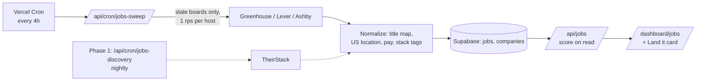

# RFC: Job listings in Land it

**Author:** Jordan Lamoreaux
**Date:** 2026-09-24
**Status:** Draft (rev. 2, retargeted to the actual stack and user base)
**Project:** CareerOtter (apptrack.ing)

> **Revision note (rev. 2).** Rev. 1 assumed a Cloudflare Workers + Queues + KV pipeline, a user base
> large enough to share vendor search buckets, and a tracker full of Greenhouse/Lever/Ashby links.
> Production data says otherwise (section 0). The main changes:
>
> 1. **Stack.** Vercel Cron routes plus Supabase Postgres, the same pattern as the stock-price cron.
>    No Cloudflare, no queue, no KV. The feed is computed on read.
> 2. **Source strategy.** Tracked-company links cover only 19 of 52 tracking users, so a feed built
>    only from each user's own tracker can't fix day-one activation. Phase 0 now sweeps a **shared
>    pool of public ATS boards**: every company any user tracks, plus a curated seed list. That
>    gives $0 discovery for new users. TheirStack moves to Phase 1 and is gated on measured feed
>    thinness, not on a schedule.
> 3. **Role families.** Two-thirds of tracking users are not in the four comp-tracker families.
>    Customer support/success is the largest group. The taxonomy adds `customer_success` and
>    `other`.
> 4. **"Above your band"** stays, but it is designed as the minority state. Two users have ever
>    logged comp, so the no-comp header is the default experience and the comp prompt is a primary
>    metric.
> 5. **Measurement.** Randomized 50/50 holdout on a PostHog flag, database-derived counts, and an
>    explicit statement that results at this scale are directional.
> 6. **Open questions resolved.** Database (Supabase Postgres), free-tier gating (tracking is
>    unlimited, and Jobs is free), and geography (US and US-remote only).

-----

## 0. Ground truth

### Stack

| Concern | Technology | Key locations |
| --- | --- | --- |
| Framework / hosting | Next.js App Router on Vercel (Pro: sub-daily crons already run) | `app/`, `vercel.json` |
| Database | Supabase Postgres | `lib/supabase/*`, `schemas/` |
| Scheduled jobs | Vercel Cron → `app/api/cron/**`, guarded by `verifyCronAuth`, `maxDuration = 300` | `app/api/cron/careerotter-stock-prices/route.ts` is the closest template |
| Cache | Upstash Redis | `lib/redis/client.ts` |
| Flags / analytics | PostHog | `lib/hooks/use-feature-flag.ts`, `lib/analytics/posthog.ts`, `lib/analytics/posthog-server.ts` |
| Role / level taxonomy | `COMP_ROLE_FAMILIES`, `COMP_LEVELS` | `lib/careerotter/market-data.ts` |
| Comp | `comp_entries` (`effective_date`, `base`, `currency`), service-role only | `schemas/migrations/033_careerotter_comp.sql` |
| Career profile | `career_profiles` (`role`, `level`, `mode`) | `schemas/migrations/032_careerotter_evidence.sql` |
| Plan limits | Tracking is unlimited on every tier (`FREE_MAX_APPLICATIONS: -1`); "the wall is AI, not count" | `lib/constants/plans.ts` |

### Users and tracker data (production, 2026-09-24, aggregate queries only)

| Measure | Value |
| --- | --- |
| Profiles | 235 (20 signups in the last 30 days) |
| Users who have ever tracked an application | 52 |
| Users who added an application in the last 14 / 30 days | 8 / 12 |
| Applications / with a `role_link` / distinct companies | 261 / 240 / 220 |
| Users who have logged comp | 2 |
| `career_profiles` rows | 1 |

**Link mix.** Of 261 applications: 74 (28%) link directly to a Greenhouse, Lever, or Ashby board.
20 (8%) are Greenhouse embeds on a company careers page (`gh_jid=`), 20 (8%) are Workday, and 16
(6%) are LinkedIn.

**Slug guessing.** For the 152 companies without a direct link, normalizing the company name and
probing all three board APIs found a live board for 45. A hand check flags about five of those as
wrong or ambiguous (for example "Stealth Startup" and "LinkedIn"), so guesses need verification
(section 4.2).

**Coverage from a user's own tracker.** Direct links plus guesses cover 124 of 261 applications
(48%). They cover only **19 of 52 users (37%)**, and **4 of the 12 users active in the last 30
days**. Applications are concentrated in a few heavy users. A day-one user has zero or one
application. **A feed built only from each user's own tracked companies can't carry activation.**

**Role mix.** Classifying each user's most common tracked title: 15 software engineering, 1 product,
1 data, 0 design, and 35 other. The largest "other" cluster is customer support and success
("support", "customer", "success", "CSM", "technical support"). Next are analyst, operations, and
coordinator roles.

**ATS pay coverage (spot probes).**

| Board | Open roles | Structured pay |
| --- | --- | --- |
| Ashby (Ramp) | 155 | 148 via `compensationTiers` |
| Lever (Zoox) | 236 | 222 via `salaryRange` |
| Lever (Palantir) | 318 | 0 |
| Greenhouse (Stripe) | 692 | 0. `pay_input_ranges` is present but empty, so pay has to be parsed from `content` HTML |

Board size matters too. Stripe alone has 692 open roles, so every feed needs filtering from day
one.

-----

## 1. Summary

Add a Jobs feed to Land it that shows open US and US-remote roles matched to the user's role
family, level, and location, ranked by fit. When both sides are known, roles whose posted pay
starts above the user's current base sort first.

Phase 0 costs $0. A Vercel cron sweeps the public Greenhouse, Lever, and Ashby board APIs for a
shared pool of companies: every company any user tracks, plus a curated seed list of US employers.
Listings land in Postgres, and each user's feed is computed on read from that table. Users never
cause an outbound call.

Phase 1 adds TheirStack as a paid discovery source ($49/month for 1,500 records) only if Phase 0
shows engagement **and** the pool leaves a measurable share of users with thin feeds. That share is
most likely the non-tech roles the startup-heavy ATS pool under-covers.

The feed connects Land it to Track it. The "pays above your band" sort needs a logged comp, so the
no-comp state asks for one.

## 2. Motivation and goals

Activation is the binding constraint: users drop off after day one or two. A tracker only gets
opened when the user has something new to log. A feed of fresh, matched roles gives a reason to
return on day three that doesn't depend on the user's own activity. That is exactly why the feed
can't be built only from the user's own tracker (section 0).

The brand guide commits to this surface: "24 roles match your level and stack. Six pay above your
current band. Sorted by that." This RFC makes that line true for the users it can be true for, and
gives everyone else an honest version.

**Goals**

1. A new user who gives role family, level, and location on day one sees a matched feed that same
   day. It must not depend on how many applications they have tracked.
2. One click adds a listing to the tracker, prefilled with company, role, `role_link`, and
   `date_applied`.
3. When both the listing's posted pay and the user's comp are known, roles whose `pay_min_usd` is
   strictly above the user's current base sort first.
4. Phase 0 runs at $0 beyond existing Vercel and Supabase plans. Phase 1 discovery stays within
   $49/month until the upgrade rule in section 7 fires.
5. A listing that disappears from its ATS board is hidden within 24 hours. A listing that can't be
   re-verified is hidden within 72 hours (ATS) or 30 days (TheirStack).

**Non-goals for v1**

- Applying inside CareerOtter. We link out to the employer's apply page.
- Scraping LinkedIn, Indeed, or Glassdoor, directly or by displaying vendor records that point to
  them.
- Coverage outside the US and US-remote. Canada is deferred to a later revision.
- Workday boards. They are 8% of tracker links, but there is no public, documented posting API.
  Revisit in v1.1.
- Job alert emails and push notifications (Phase 2).
- Employer-side posting or any recruiter product.

## 3. Data sources

| Source | What it gives us | Cost | Constraint | Role |
| --- | --- | --- | --- | --- |
| Greenhouse Job Board API | A company's open roles; `content` HTML per job | Free, no key | Needs the board token. Structured pay is usually empty, so parse the HTML | Phase 0 pool |
| Lever Postings API | Open roles; `salaryRange` when the employer sets it | Free, no key | Needs the slug. Pay coverage varies by employer (0% to 94% in probes) | Phase 0 pool |
| Ashby Posting API | Open roles; `compensationTiers` with `includeCompensation=true` | Free, no key | Needs the slug | Phase 0 pool |
| [TheirStack](https://theirstack.com/en/pricing) | Deduplicated postings with normalized salary, seniority, location, and technology | $49/month for 1,500 API credits. 1 credit per job returned, including repeats. Unused credits roll over for 12 months | Indexes job boards including LinkedIn, so records must be filtered to employer URLs at query time | Phase 1, gated |
| Adzuna | Search and salary histograms | Free tier | Logo on every listing; licence limits beyond display | Fallback only |
| JSearch (OpenWeb Ninja) | Google for Jobs results | Free tier | Resells scraped results | Rejected |
| Indeed, LinkedIn | n/a | n/a | Publisher API deprecated / partner-only | Unavailable |

## 4. The board pool

### 4.1 What is in it

The `companies` table holds every board we sweep. A company enters the pool in one of four ways,
recorded in `slug_source`:

| `slug_source` | How | Phase 0 volume |
| --- | --- | --- |
| `link` | Parsed from an application's `role_link`: `boards.greenhouse.io/{slug}`, `job-boards.greenhouse.io/{slug}`, `jobs.lever.co/{slug}`, `jobs.ashbyhq.com/{slug}` | ~67 companies |
| `embed` | The `role_link` carries `gh_jid=`. Fetch the careers page once and read the `for=` token from the Greenhouse embed script | Up to 20 applications |
| `guess` | Normalized company name probed against all three APIs, then verified (4.2) | ~40 companies |
| `seed` | Curated list of US employers on the three ATSs, weighted toward the families in section 0 | Target 300 companies |

The pool is global. A company being in it reveals nothing about which user tracks it. The per-user
"tracked" signal comes from joining `applications` at read time.

Every resolution runs when an application is created or its link changes (inline, off the request
path), with a nightly backfill for rows that failed.

### 4.2 Verifying guessed slugs

A guessed slug is accepted only when one of these holds:

- **Greenhouse:** `GET /v1/boards/{token}` returns a `name` that normalizes to the same string as the
  tracked company name.
- **Lever / Ashby:** the company name appears in at least half of the returned postings'
  descriptions.

In addition:

- A deny-list rejects generic names ("stealth", "confidential", "startup", "stealth startup").
- A listing action, "Not this company", marks the company `ats_status = 'disputed'`. It pauses the
  sweep for that company and flags it in the admin view.

### 4.3 Seed list

`lib/jobs/seed-boards.ts` holds `{ ats_type, ats_slug, name, domain }` entries, loaded by an
idempotent upsert. Start from the ~110 companies the tracker already resolves. Those are, by
definition, companies our users apply to. Extend to about 300 by hand, deliberately including
support/success-heavy employers (B2B SaaS, fintech, health tech) so the 35 "other" users are not
left with an engineering-only pool.

## 5. Architecture



1. **Sweep cron** (`/api/cron/jobs-sweep`, schedule `30 */4 * * *`, `maxDuration = 300`).
   - **Selection.** Each run picks companies with `ats_status = 'active'` and `last_swept_at` older
     than 20 hours, oldest first.
   - **Pacing.** Three hosts are fetched in parallel, one request per second per host. The run stops
     at about 270 seconds and leaves the remainder for the next run. That is about 250 companies
     per host per run, and six runs a day. The 300-company pool is swept daily with a wide margin,
     and the same design holds past 1,000 companies before a queue is worth adding.
   - **Greenhouse.** Fetch the list without `content`, and fetch the detail endpoint only for jobs
     that are new or have a changed `updated_at` and that pass the cheap pre-filter (US location
     and a mapped role family). Lever and Ashby lists already carry descriptions.
   - **Etiquette.** `User-Agent: CareerOtter jobs sweep (contact: <support address>)`.
   - **Closures.** A job absent from a board that fetched successfully gets `closed_at = now()`.
   - **Errors.** A 404 or 403 on a board sets `ats_status = 'disabled'` for review. It is not
     retried nightly.
   - **Shape.** Follows the stock-price cron: `verifyCronAuth`, `createAdminClient`,
     `loggerService`, and a hard `MAX_COMPANIES` backstop.
2. **Normalizer** (`lib/jobs/normalize.ts`), shared by both sources:
   - **Title map** (`lib/jobs/title-map.ts`): rules that map a title to a role family and level.
     Unknown results stay `null` rather than guessing.
   - **Location:** parse US state names and abbreviations, "United States", "US", and "Remote (US)"
     variants into `city`, `region`, `country`, and `remote_type`. Anything that doesn't parse as
     US is dropped in v1.
   - **Pay:** see 6.3.
   - **Stack tags:** dictionary match against about 150 technology terms
     (`lib/jobs/stack-tags.ts`). Empty for non-engineering roles, which is expected.
3. **Feed API** (`GET /api/jobs`) computes the feed on read:
   - Load the user's prefs, their tracked companies (with status), their dismissals, and their
     latest comp row.
   - Select open US jobs by the `(role_family, level)` index. With a 300-board pool this is a few
     hundred candidate rows.
   - Score in TypeScript and return the top 50.
   - No cache layer in v1. If p95 goes over 300 ms, add a 12-hour Upstash entry per user,
     invalidated on prefs, comp, or tracker changes.
4. **UI.**
   - `app/(app)/dashboard/jobs` is the page. A one-line count card goes in the Land it tools
     section of `app/(app)/dashboard/applications/page.tsx`.
   - Each listing has four actions: add to tracker, save, dismiss, and a menu with "Report dead
     link" and "Not this company".
   - Client components call `/api/jobs*` routes only (CLAUDE.md rule 4).
5. **Discovery cron** (Phase 1 only). See section 7.

All new tables live in the same Supabase database as `applications` and `comp_entries`, because the
feed joins all three.

## 6. Data model, taxonomy, and pay

### 6.1 Migration `044_job_listings.sql`

Every table has RLS enabled with no policies (service-role API routes only), matching
`comp_entries` and `career_profiles`.

```sql
create table public.companies (
  id uuid primary key default gen_random_uuid (),
  name text not null,
  normalized_name text not null,
  domain text,                               -- nullable: ATS slugs don't give us one
  ats_type text check (ats_type in ('greenhouse', 'lever', 'ashby')),
  ats_slug text,
  slug_source text check (slug_source in ('link', 'embed', 'guess', 'seed', 'theirstack')),
  ats_status text not null default 'active'
    check (ats_status in ('active', 'disabled', 'disputed')),
  last_swept_at timestamptz,
  created_at timestamptz not null default now(),
  unique (ats_type, ats_slug)
);
create unique index companies_domain_key on public.companies (domain) where domain is not null;

-- Links a tracked application to its board, so "tracked" scoring and add-to-tracker dedupe work
-- without fuzzy matching on free-text company names at read time.
alter table public.applications
  add column company_id uuid references public.companies (id) on delete set null;

create table public.jobs (
  id uuid primary key default gen_random_uuid (),
  source text not null check (source in ('greenhouse', 'lever', 'ashby', 'theirstack')),
  source_job_id text not null,
  company_id uuid references public.companies (id) on delete cascade,
  title text not null,
  role_family text,                          -- null = unmapped
  level text,                                -- null = unknown
  city text, region text, country text not null default 'US',
  remote_type text check (remote_type in ('onsite', 'hybrid', 'remote')),
  pay_min_usd integer, pay_max_usd integer,
  pay_basis text not null default 'none' check (pay_basis in ('structured', 'parsed', 'none')),
  pay_tiers jsonb,                           -- every posted geo tier, for location-aware band checks
  stack_tags text[] not null default '{}',
  apply_url text not null,
  posted_at timestamptz,
  first_seen_at timestamptz not null default now(),
  last_seen_at timestamptz not null default now(),
  closed_at timestamptz,
  raw jsonb not null,
  unique (source, source_job_id)
);
create index jobs_open_family_level_idx on public.jobs (role_family, level) where closed_at is null;
create index jobs_open_company_idx on public.jobs (company_id) where closed_at is null;

create table public.user_job_prefs (
  user_id uuid primary key references public.profiles (id) on delete cascade,
  role_family text not null,
  level text,
  locations text[] not null default '{}',    -- US metros or states
  remote_ok boolean not null default true,
  stack_tags text[] not null default '{}',
  updated_at timestamptz not null default now()
);

create table public.user_job_actions (
  user_id uuid not null references public.profiles (id) on delete cascade,
  job_id uuid not null references public.jobs (id) on delete cascade,
  action text not null
    check (action in ('saved', 'dismissed', 'added', 'apply_clicked', 'reported_dead', 'not_this_company')),
  created_at timestamptz not null default now(),
  primary key (user_id, job_id, action)
);
```

Rev. 1's `search_buckets` table and `user_job_prefs.bucket_id` are dropped. Phase 1 derives buckets
with a `GROUP BY` over prefs (section 7), so there is no membership to store or keep in sync.

`raw` keeps the source payload so we can re-normalize without refetching. That matters more for
TheirStack records, which cost a credit each.

### 6.2 Taxonomy

Extend the comp-tracker families rather than inventing a parallel set. Move them to
`lib/constants/job-taxonomy.ts` (CLAUDE.md: centralize constants), and have
`lib/careerotter/market-data.ts` import the four it has ranges for.

- **Families:** `software_engineer`, `product_manager`, `data`, `design`, `customer_success`
  (support, success, CSM, technical support, implementation), `other`.
- **Levels:** `junior` (intern, entry, I, associate), `mid` (II, unmarked), `senior` (Sr, III),
  `staff` (staff, principal, lead, head of).
- **Unmapped values stay `null`.** A null level passes the level filter with a lower score (6.4).
  A null family never matches.

**Title-map accuracy gate.** Before Phase 0b, hand-label 200 titles pulled from the swept pool.
Require 90% family accuracy and 85% level accuracy.

### 6.3 Pay

| Source | Extraction | `pay_basis` |
| --- | --- | --- |
| Ashby | `compensationTiers[].components` where `compensationType = 'Salary'`, with interval and currency | `structured` |
| Lever | `salaryRange { min, max, currency, interval }` | `structured` |
| Greenhouse | `pay_input_ranges` when non-empty; otherwise parse `content` for US ranges ("$120,000 – $150,000", "$120K–$150K") | `structured` or `parsed` |
| TheirStack | `min_annual_salary_usd` / `max_annual_salary_usd` (verify field names) | `structured` |

Rules:

- Only annual USD base ranges count.
- Hourly, equity-only, OTE-only, and unparseable text become `none`.
- A parsed range is accepted only when `20,000 ≤ min ≤ max ≤ 2,000,000`.
- Never store an estimate.

**Multiple geo tiers** go into `pay_tiers`. For the band check, use the tier whose label matches the
user's location. If no tier maps, use the **lowest** minimum across tiers, so the claim errs toward
not firing.

### 6.4 Prefs

Set on a three-field setup screen: role family, level, and location/remote. Stack tags are an
optional fourth field shown only to engineering and data families. The screen is shown the first
time a user opens Jobs, and optionally as an onboarding step (open question 3).

The fields are prefilled from, in order:

1. `career_profiles.role` / `level` when present.
2. The title map run over the user's last ten `applications.role` values (majority vote).
3. Blank.

Roast uploads are never used. They are deleted after 24 hours and were never consented for this
use.

## 7. Matching and ranking

**Hard filters.** A job appears only when all of these hold:

- It is open (`closed_at is null`) and US.
- Its `role_family` equals the user's.
- Its `level` is within one step of the user's, or is null.
- Its location matches one of `locations`, or it is remote and `remote_ok` is set.
- The user hasn't dismissed it.
- It isn't already in the user's tracker (by `apply_url`, or by `company_id` + normalized title).

**Score.** Weighted sum. Terms that don't apply to the user are dropped and the remaining weights
renormalized, so a support specialist with no stack tags isn't capped at 0.65.

```
S = (0.35·stack + 0.25·level + 0.20·tracked + 0.20·fresh) / (sum of weights for terms that apply)
```

- **stack:** Jaccard overlap of job and user tags. Dropped when the user has no tags. Defined as 0
  when the job has none.
- **level:** 1 for exact, 0.5 for one step off, 0.25 for unknown.
- **tracked:** 1 when `company_id` matches one of the user's applications with a non-`Rejected`
  status, 0.5 when every match is `Rejected`, 0 otherwise.
- **fresh:** linear from 1 at `posted_at` (falling back to `first_seen_at`) to 0 at 30 days.

The weights are starting values. Tune them against add-to-tracker rate once there are 200 or more
feed views.

**Above your band.**

- **Current base** is the `comp_entries` row with the latest `effective_date`. In v1 only `USD`
  rows count; all existing rows are USD.
- **A job counts** when `pay_basis <> 'none'` and its location-appropriate minimum (6.3) is
  **strictly greater** than the current base.
- **Sort:** above-band jobs first, then by score. Without comp, sort by score alone.

| State | Header copy |
| --- | --- |
| Comp logged, some roles above band | 24 roles match your level and stack. 6 pay above your current band. Sorted by that. |
| Comp logged, none above band | 24 roles match. None post pay above your current base. That's useful to know before your review. |
| No comp logged (the default today) | 24 roles match your level and stack. Log your current pay in Comp and we'll sort by which ones pay more. |
| No stack tags | Same copy with "your role and level" in place of "your level and stack". |
| Zero matches | Nothing matches today. Widen location or level in your job settings. |

The count words are digits, and the band line only appears when three or more roles qualify, so a
single outlier never headlines.

## 8. Phase 1: TheirStack discovery (gated)

TheirStack is added only when both of these hold at the end of Phase 0b:

- Phase 0b meets its engagement targets (section 10).
- More than 30% of exposed users have fewer than 10 matches ("thin feeds").

If the pool alone gives most users a full feed, the $49/month buys nothing.

**Buckets.** Derived nightly:

```sql
select role_family, level, geo, count(*) as users
from user_job_prefs p join <active users in last 14 days> using (user_id)
cross join lateral <geo keys: 'US_REMOTE' if remote_ok, plus each location's state>
group by 1, 2, 3
```

- Stack is **not** part of the bucket key. It is scored locally.
- The theoretical maximum is 6 families × 4 levels × a few geos. At today's active base, expect
  5 to 10 buckets.

**Budget.**

- The nightly budget is `floor(remaining_monthly_credits / days_left_in_month)`, about 50 a night
  on the $49 plan.
- It is split across buckets by user count, with a floor of 3 and a ceiling of 15 per bucket.
- A newly created bucket gets a one-time backfill of up to 20 jobs from the past 7 days, charged to
  the same budget.
- The fetcher checks remaining budget before each page and stops at zero. An overrun is a bug, not
  a bill.

**Query shape** (`POST /v1/jobs/search`). Every exclusion is applied server-side, because only
returned records are billed:

| Filter | Value |
| --- | --- |
| `discovered_at_gte` | Last successful run time. Not a posted-age window, which misses late-indexed jobs and re-buys overlaps |
| `job_country_code_or` | `["US"]` |
| `job_seniority_or` | Mapped from the bucket level |
| `url_domain_not` | `["linkedin.com", "indeed.com", "glassdoor.com", "ziprecruiter.com"]` |
| Final URL present | Via `property_exists_or` (the older `final_url_exists` is deprecated) |
| Company exclusion | Domains of companies already in the board pool, which we get free |
| Employer type | Direct employers only; exclude recruiting agencies |
| `job_id_not` | IDs bought in the last 7 days, as a second guard against repeats |
| Ordering | Explicit sort so the 3 to 15 records per bucket are the best ones (salary present first, then recency), not an arbitrary slice |

**Guardrails and the upgrade rule.**

- A server-side dashboard tracks credits per day, credits per active user, and the share of bucket
  runs that hit their cap.
- Move up a tier only when more than 25% of bucket runs hit their cap for two straight weeks and
  engagement still meets target. Rollover means a quiet month isn't wasted spend.
- Don't subscribe to TheirStack `job.closed` webhooks. They bill a credit per event. Closure comes
  from URL checks (section 9) or from the ATS sweep once the company joins the pool.

**Growing the pool.** When a TheirStack record's final URL is on a Greenhouse, Lever, or Ashby
host, upsert that company into the pool (`slug_source = 'theirstack'`). From then on its roles come
from the free sweep and it is excluded from paid queries. This way discovery spend grows the free
pool over time.

## 9. Compliance, attribution, freshness

- **Linking out.** Show a short summary and link to the employer's apply page. Never host an
  application form. Never resell or bulk-export.
- **ATS boards.** These endpoints are published for embedding. Sweep each board at most once a day,
  at one request per second per host, with a contact `User-Agent`. Disabled boards are reviewed,
  not hammered.
- **TheirStack.** Only records whose final URL is on the employer's domain or a known ATS host are
  shown. Before launch, confirm the attribution requirement (open question 1).
- **Privacy.** Board sweeps carry no user data. TheirStack bucket queries carry role family, level,
  geography, and seniority only. No user ID, email, or employer ever goes to a vendor, and matching
  runs on our side.
- **Freshness, ATS.** Closed when absent from a successful sweep, which means within 24 hours given
  daily sweeps. Hidden after 72 hours without a sighting even if sweeps fail.
- **Freshness, TheirStack.** Hidden at 30 days after posting. Jobs currently in any user's feed are
  rechecked nightly and hidden on any of:
  - a 404 or 410;
  - a redirect to a different path, which is usually the careers homepage;
  - closure text in the body ("no longer accepting", "position has been filled", "job not found").

  Many sites return 200 for closed jobs, so a status check alone misses most closures.
- **Dead-link reports.** A report hides the listing for the reporter immediately and triggers an
  immediate recheck. It is hidden for everyone when the recheck confirms, or when two distinct
  users report it. A single report can't hide a listing for everyone.
- **Pay claims.** The band label only uses employer-posted ranges (6.3).

## 10. Rollout and metrics

| Phase | Scope | Exit criteria |
| --- | --- | --- |
| **0a: build and internal** | Migration 044, resolver (link, embed, guess + verify), seed list, sweep cron, normalizer, `/api/jobs`, `/dashboard/jobs`, Land it card, add-to-tracker. PostHog flag `jobs-feed` on for Jordan only | Title-map gate (6.2) passes. US location parse ≥ 95% precision on 200 labeled locations. Zero dead links in a 50-listing spot check. Sweep finishes the pool inside one day's runs |
| **0b: everyone, with holdout** | Flag on for a random 50% of all users, new signups included. The other 50% is the holdout | Measured after 6 weeks against the targets below |
| **1: discovery** | TheirStack per section 8 | Only if the section 8 gate fires. Same targets, plus credits per weekly active under 50 |
| **2: pull back in** | "New roles at companies you track" section added to the existing weekly digest (`app/api/cron/weekly-digest`) and in-app notifications. Layoff-risk flags on `companies` | Digest click rate above the 4.3% baseline from the July 10 blast |

**Events** (client: `capturePostHogEvent`; server: `captureServerEvent`): `jobs_feed_viewed`,
`jobs_setup_completed`, `job_saved`, `job_dismissed`, `job_added_to_tracker`, `job_apply_clicked`,
`job_dead_link_reported`, `job_not_this_company`, `job_prefs_updated`, `comp_logged_from_jobs_prompt`.

**Count from the database where possible.**

- Adds are `applications` rows with a `company_id` created through the feed, recorded in
  `user_job_actions`.
- Setup completions are `user_job_prefs` rows.
- Comp from the prompt is a `comp_entries` row tagged by the API route.
- PostHog's ad-blocker undercount (about 60%) doesn't distort ratios computed inside PostHog, but
  it does distort absolute counts. Read absolute counts from the database.

| Metric | Phase 0b target | Source |
| --- | --- | --- |
| Exposed weekly actives who open Jobs | 30%+ | PostHog, ratio |
| Adds to tracker per 100 feed views | 10+ | DB adds / PostHog views |
| Exposed users with at least 10 matches (feed depth) | Reported, and drives the Phase 1 gate | DB |
| Feed listings with a posted pay range | 40%+ (reported by family; expected lower for `customer_success`) | DB |
| Comp logged from the no-comp prompt | 15% of users who see it. **Primary for the Track it handoff**, because the no-comp state is the default | DB |
| D7 return, exposed vs. holdout | +10 points | PostHog cohorts |

**Reading the D7 result honestly.** At about 20 signups a month, six weeks gives roughly 15 new
users per arm. That can't statistically confirm a 10-point lift. The randomized holdout removes
self-selection bias, which rev. 1's "viewed Jobs vs. didn't" comparison had. The ship decision
still rests on three things together: the D7 direction, the leading indicators above, and five
user conversations with exposed users. Say so in the readout.

## 11. Cost

| Item | Monthly cost |
| --- | --- |
| Phase 0 sweep (about 300 boards/day, mostly idle waiting on 1 rps pacing) | $0 incremental. Well inside the Vercel Pro plan's included function usage |
| Phase 0 storage (tens of thousands of `jobs` rows with `raw`) | $0 incremental on the current Supabase plan. Re-check if `raw` passes 1 GB; `closed_at` rows older than 90 days can drop `raw` |
| Phase 1 TheirStack | $49 for 1,500 credits, about 50 records/night. Starts only if gated in |

| Approach | Credits/month at ~30 weekly actives | Plan |
| --- | --- | --- |
| Live vendor query per feed view (5 views/week, 20 jobs) | ~13,000 | Beyond $49 |
| Nightly buckets, ~8 buckets, ~6 new jobs each, plus backfills | ~1,500 | $49 |
| Phase 0 board pool | 0 | $0 |

## 12. Risks

| Risk | Mitigation |
| --- | --- |
| The pool skews to tech startups, and most users are not engineers | Seed list deliberately includes support/success-heavy employers. Feed depth by family is reported. Thin non-tech feeds are exactly what triggers Phase 1 |
| Wrong guessed slug shows another company's jobs | Verification rules (4.2), deny-list, "Not this company" action, `disputed` status |
| Greenhouse pay parsing is wrong | Strict acceptance bounds. Parsed ranges are marked `parsed`. Spot-check 50 parsed ranges in 0a. The band label never uses unparsed text |
| Level mapping differs by company ("Staff" at a startup vs. Google) | ±1 window. Log dismissals by level delta and adjust the map |
| Few listings post pay, so the band sort rarely fires | CA, CO, NY, WA, and IL pay-transparency laws cover much of US tech. Band line needs 3+ qualifying roles |
| Board API changes or rate limiting | Per-host pacing. Disable-on-4xx. A sweep failure only delays freshness, and the 72-hour rule hides stale rows |
| TheirStack dependency (Phase 1) | Schema is source-agnostic. JobsPipe and Coresignal use the same per-record billing, so switching means rewriting one fetcher |

## 13. Alternatives considered

- **Cloudflare Workers + Queues + KV (rev. 1).** Rejected. It adds a second platform holding
  Supabase service-role credentials, and a Cloudflare API call on every feed view from Vercel.
  A queue isn't needed below about 1,000 boards. Revisit only if the sweep outgrows cursor batching
  in 300-second functions.
- **Tracked-company feed only (rev. 1 Phase 0).** Rejected as the primary strategy. It covers 37%
  of tracking users and almost no day-one users, so it can't address activation. It survives as
  the `tracked` ranking signal.
- **TheirStack from day one.** Deferred. The free pool may be enough, and paid credits should target
  the measured gap.
- **Live vendor query per feed view.** Rejected. Cost scales with engagement.
- **Adzuna as the main source.** Rejected. Attribution logo and licence limits on salary data.
- **Scraping careers pages or job boards.** Rejected. Terms risk and maintenance, for data the ATS
  APIs already publish.

## 14. Decisions (resolved from rev. 1)

- **Database:** Supabase Postgres, same database as `applications` and `comp_entries`. RLS on, no
  policies.
- **Gating:** Jobs is free for everyone. Tracking is already unlimited on every tier, and the feed
  exists to fix activation, not to sell Pro.
- **Geography:** US and US-remote only. Canada is out of v1.
- **Hosting:** Vercel Cron and Next.js route handlers.

## 15. Open questions

- [ ] **TheirStack attribution** (Phase 1 only). Does their API licence require on-page attribution?
  If yes, add "Listings via TheirStack" to discovered listings only.
- [ ] **TheirStack parameter names** (Phase 1 only). Verify, against the current API reference, the
  employer-type filter, the company-domain exclusion, the `property_exists_or` value for final URL,
  the seniority enum, and the salary field names. `discovered_at_gte`, `job_country_code_or`,
  `job_seniority_or`, `url_domain_not`, and `job_id_not` are confirmed.
- [ ] **Setup placement.** Put the three-field job setup in onboarding (`lib/onboarding/flows.ts`)
  or on first Jobs visit? Onboarding reaches day-one users, which is the activation goal, but adds
  a step to a flow users already drop out of.
- [ ] **Holdout cost.** Is withholding Jobs from half of new users for six weeks acceptable at ~20
  signups a month? The alternative is no holdout and a weaker, confounded comparison.
- [ ] **Seed list ownership.** Who curates and reviews the ~190 hand-added seed boards, and how often?
- [ ] **Workday.** Worth a v1.1 given 8% of tracker links? It has no documented public API.

## Appendix: how the section 0 numbers were produced

- **Tracker, comp, profile, and role numbers.** Read-only aggregate SQL against production
  Supabase on 2026-09-24. Role families come from a regex classifier over `applications.role`,
  taking each user's most common family. It is coarse, but it is enough to show the mix.
- **Slug guessing.** Each unresolved company name was lowercased, legal suffixes were stripped,
  and it was tried joined and hyphenated against the Greenhouse, Lever, and Ashby public APIs, at
  about one request per second per host. A hit required a live board with at least one open role.
  No user data other than company names was sent.
- **Pay coverage.** Public board API responses for Ramp (Ashby), Zoox and Palantir (Lever), and
  Stripe (Greenhouse).
